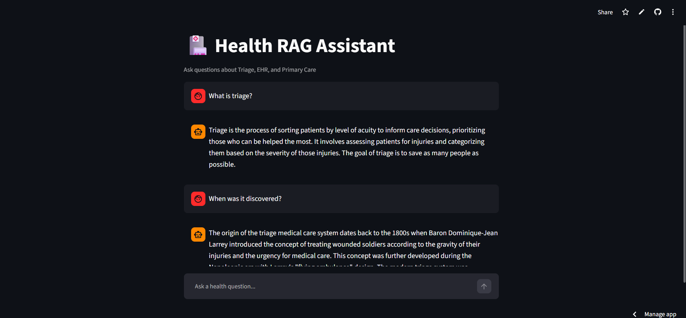

# 🏥 Health RAG Assistant

A conversational RAG (Retrieval-Augmented Generation) system built on clinical health documents — Triage, EHR, and Primary Care.

## 🔴 Live Demo
[health-rag-assistant.streamlit.app](https://health-rag-assistant.streamlit.app)



## 🧠 What It Does
- Answer questions from clinical health documents
- Remembers conversation history for follow-up questions
- Resolves vague follow-up questions like "How did it originate?" using chat context

## 🏗️ Architecture
```
User Question → Rewrite with Chat History → ChromaDB Retrieval → Groq LLaMA → Answer
```

## 🛠️ Tech Stack
- **LangChain** — RAG pipeline
- **ChromaDB** — Vector store with cosine similarity
- **HuggingFace** — all-MiniLM-L6-v2 embeddings (free, local)
- **Groq LLaMA 3.1** — Fast free LLM inference
- **Streamlit** — Chat UI and deployment

## ⚡ Key Problem Solved
LLM was ignoring retrieved context and hallucinating answers. Fixed through:
- Prompt engineering with explicit constraints
- Retrieval score thresholding (0.3) to filter noisy chunks

## 🚀 Run Locally
```bash
git clone https://github.com/amitsaini-dev/health-rag-assistant
cd health-rag-assistant
pip install -r requirements.txt
# Add GROQ_API_KEY in .env
python ingestion_pipeline.py
streamlit run app.py
```